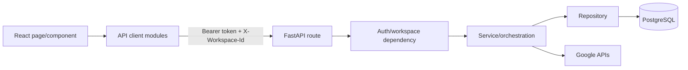

# API Flow Audit

## Frontend-to-Backend Flow

## Route Inventory

Total route decorators found: **89**.

Main groups:

- `/api/auth` and `/auth`
- `/api/admin`
- `/api/dashboard`
- `/api/google/connection`
- `/api/google/oauth`
- `/api/data-sources`
- `/api/sync-jobs`
- `/api/classifications`
- `/api/import`
- `/api/inquiry`
- `/api/settings`
- `/api/budgets`
- `/api/workspaces`
- `/api/workspace-invitations`

## Contract Risks

- Static bearer token produces no user identity; some dashboard routes fall back to legacy Google Sheet reads.
- Workspace selection is client-provided but normally validated by membership.
- Configuration update uses global user role instead of workspace role.
- Several routes perform long Google API work synchronously.
- Dashboard frontend calls many fine-grained endpoints rather than one bounded aggregate endpoint.
- Error language and payload shapes vary by module.
- No idempotency key support found for import approve, retry sync, source sync, invitations, or budget mutations.
- Route versioning is absent.

## Potential Broken or Ambiguous Routes

- Explicit React Router routes are not used; pathname parsing occurs inside `Dashboard.jsx`.
- `/dashboard` works through SPA fallback, but page ownership is implicit.
- Register route/page: **Potential Missing Flow**.
- Dedicated analytics route: rendered as an internal dashboard view, not a separate route.
- Dedicated alerts delivery API: **Potential Missing Route**; current feature is forecast/alert state.

## Recommended API Boundary

- `GET /api/dashboard/view-model` for the main dashboard payload.
- `GET /api/analytics/view-model` for analytics payload.
- Async commands returning job IDs for source sync, import append, and classification.
- Idempotency key on every externally repeatable command.
- Consistent error envelope with code, safe message, request ID, and retryability.

