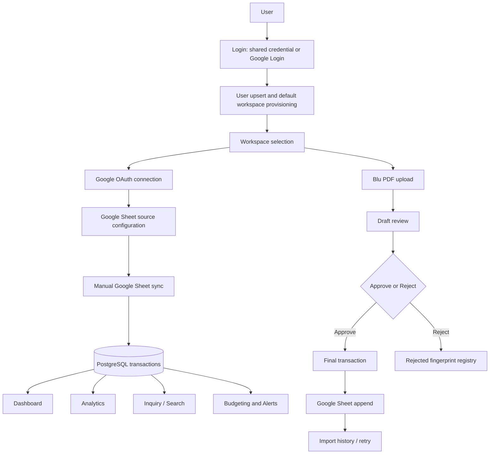

# Business Flow Audit

## Implemented High-Level Flow

## Flow Assessment

| Flow | Status | Audit note |
|---|---|---|
| Login | Implemented | Shared static credential remains a legacy production risk |
| Register | Need Verification | No explicit register page; Google login auto-provisions user and workspace |
| Workspace | Implemented | Primary workspace fallback can occur without explicit selection |
| Invite member | Partial | Pending/accept/decline/cancel exist; email delivery and expiry automation absent |
| Google OAuth login | Implemented | Token returned via URL fragment then stored in localStorage |
| Google OAuth connection | Implemented | Bound to signed user/workspace state |
| Google Sheet | Implemented | Source test/create/list/delete and worksheet discovery exist |
| Sync | Implemented | Runs synchronously in API request; durable worker absent |
| Dashboard | Implemented | High API fan-out and all-or-nothing error behavior |
| Analytics | Implemented | Re-fetches data already loaded for dashboard |
| Search / Inquiry | Implemented | Keyword search only; offset pagination |
| Budgeting / Alerts | Implemented foundation | Alerts are forecast/status output, not an independent durable notification engine |
| Blu PDF Import | Implemented | Tenant identity and DB/Sheet consistency blockers |
| Draft Review | Implemented | Category/notes updates are merged before approval |
| Approve | Implemented | Final DB rows survive sheet failure by design; external append transaction pattern is unsafe |
| Reject | Implemented | Rejected fingerprint suppresses future imports globally, not per workspace |
| History | Implemented | Unbounded job list; retry limited to first 50 details in response |
| Settings | Implemented | Workspace authorization defect on configuration update |

## Recovery and Confirmation Audit

- Google sync: errors are stored and source status is updated; retry is manual.
- Smart Import: failed spreadsheet delivery retains final DB rows and exposes retry.
- Failed upload: job is retained as failed; temp cleanup behavior varies by failure path.
- Workspace invitation: duplicate active/pending invites are guarded; delivery recovery is absent.
- Dashboard: retry requires page/view action; widget-level recovery is limited.
- Destructive actions requiring browser verification: Google disconnect, source delete, budget bulk delete, user delete, invitation cancel.

## Ownership and Source of Truth

- Intended ledger source of truth after sync: PostgreSQL.
- User-facing operational source also includes Google Sheets.
- Smart Import writes PostgreSQL before Google Sheets and retains DB rows on sheet failure.
- This is reasonable only if PostgreSQL is explicitly declared authoritative and Google Sheet is treated as a delivery projection.
- Current docs and UX still describe spreadsheet append as part of approval, so users may assume atomic consistency. Clarify product semantics.

