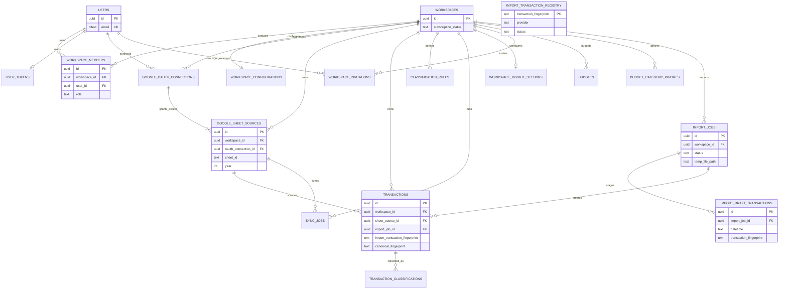

# Database Flow Audit

## Entity Relationship Diagram



`IMPORT_TRANSACTION_REGISTRY` intentionally appears disconnected because the schema has no workspace or transaction FK. This is a Critical defect for multi-tenant use.

## Source-of-Truth Classification

| Data | Role |
|---|---|
| `transactions` | Final ledger/source of truth for dashboard analytics |
| `import_draft_transactions` | Temporary review staging |
| `import_jobs` | Import lifecycle/history |
| `import_transaction_registry` | Duplicate suppression registry; currently unsafe globally |
| Google Sheets | Input source for sync and delivery projection for Smart Import |
| `transaction_classifications` | Current and historical classification state |
| `budgets` | Workspace monthly category budget |

## Constraint and Index Findings

- Good: workspace FKs, cascade rules, workspace-aware transaction uniqueness for sheet rows, budget period checks, current-classification uniqueness.
- Critical: import fingerprint uniqueness omits workspace.
- High: canonical unique index may be skipped silently if duplicates exist.
- High: duplicate numeric migration prefixes.
- Medium: category uniqueness is case-sensitive.
- Medium: `import_draft_transactions.datetime` is text.
- Medium: standalone indexes on low-cardinality status/boolean columns may add write cost with limited selectivity.
- Medium: no FK from registry to workspace/job/transaction.
- Medium: no RLS policies found in migrations.
- Need Verification: actual production indexes, constraints, duplicate counts, orphan counts, table bloat, and query plans.

## Required Pre-Production SQL Audit

Run in staging before repair:

```sql
select import_transaction_fingerprint, count(*), count(distinct workspace_id)
from transactions
where import_transaction_fingerprint is not null
group by 1
having count(*) > 1 or count(distinct workspace_id) > 1;

select canonical_fingerprint, count(*), count(distinct workspace_id)
from transactions
where canonical_fingerprint is not null
group by 1
having count(*) > 1 or count(distinct workspace_id) > 1;

select table_name
from information_schema.tables
where table_schema = 'public'
order by table_name;
```

