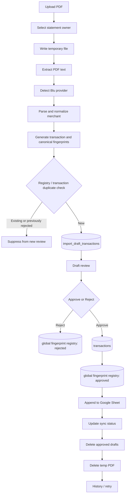

# Blu PDF Import Flow Audit



## Correctly Implemented

- Provider detection uses filename and extracted content.
- Empty text layer and unsupported provider return controlled failures.
- Draft review is separate from final transactions.
- Spreadsheet failure retains DB transactions and exposes retry.
- Temp-file cleanup and history retention are modeled.
- Import-specific tests are extensive compared with other modules.

## Critical Integrity Defects

1. Registry identity is global, not workspace-scoped.
2. Final fingerprint constraints are global.
3. Sync-status updates by fingerprint omit workspace.
4. External append runs inside a DB transaction.
5. Reject in one workspace can suppress another workspace’s valid transaction.

## Upload and Cleanup Risks

- No explicit upload size limit.
- No early `%PDF` signature/content-type enforcement.
- Temp files are local to one application instance.
- Cleanup is a process-local scheduler.
- Deletion does not enforce temp-directory containment.
- Multi-replica deployment can race cleanup or lose access to a file created on another replica.

## Approval Semantics

Current behavior intentionally treats PostgreSQL as authoritative when spreadsheet sync fails. Keep that behavior, but move delivery to a durable outbox and make UI wording explicit:

```text
Approved in Omon
Spreadsheet delivery pending / failed / succeeded
```

Do not present “Approve” as an atomic database-and-spreadsheet action.

