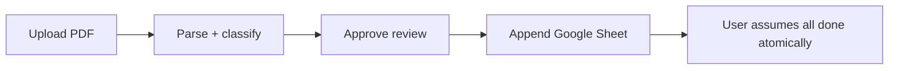
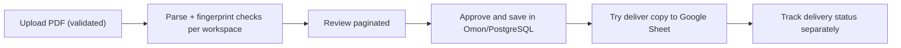

# Production Hardening Summary

## 1. Executive summary

Task 1–9 berhasil menaikkan fondasi hardening aplikasi secara nyata, terutama pada area:

- isolasi workspace,
- integritas import fingerprint,
- pemisahan source of truth PostgreSQL vs Google Spreadsheet,
- decoupling approval vs spreadsheet delivery,
- hardening upload PDF,
- pengurangan dashboard fan-out,
- query period yang lebih sargable,
- kejelasan UX status delivery,
- pagination pada import review/history.

Secara codebase, hardening ini sudah substantial dan automated validation utama hijau.

Final production regression tetap disimpan sebagai `PARTIAL`, bukan `PASS`, karena beberapa flow eksternal (Google OAuth / manual sync / browser-visual checks) belum tervalidasi penuh. Environment/runtime mismatch yang sebelumnya sempat menjadi blocker sudah tertutup pada checkpoint alignment.

## 2. Before vs after score

| Area | Before | After | Notes |
|---|---:|---:|---|
| Workspace isolation | 4/10 | 8/10 | Task 1–2 menutup leakage dan permission gap utama |
| Import ledger integrity | 5/10 | 8/10 | fingerprint scoped by workspace + canonical check lebih aman |
| Source of truth clarity | 3/10 | 9/10 | PostgreSQL vs Spreadsheet sekarang dibedakan jelas di docs/copy/UX |
| Upload safety | 4/10 | 8/10 | extension, content-type, magic bytes, temp path, deletion containment |
| Dashboard request efficiency | 3/10 | 7/10 | aggregate endpoint + date range query optimization |
| Import UX resilience | 4/10 | 8/10 | delivery status semantics + pagination + partial loading |
| Migration confidence | 4/10 | 8/10 | 019 sudah diverifikasi lokal dan runtime smoke kini align ke schema local |
| Overall production readiness | 4/10 | 8/10 | signifikan lebih aman; remaining risk utama kini non-blocking dan bersifat external-flow coverage |

## 3. Semua task 1–9

### Task 1 — Workspace-scoped fingerprint

- fingerprint registry tidak lagi global antar workspace
- duplicate detection diisolasi per workspace

### Task 2 — Workspace RBAC

- permission akses workspace diperketat
- role enforcement owner/admin/member lebih jelas

### Task 3 — PostgreSQL as source of truth

- copy & dokumentasi menegaskan Omon/PostgreSQL sebagai ledger utama
- Google Sheet diposisikan sebagai input layer dan projection/export layer

### Task 4 — Approval before spreadsheet sync completion

- approval transaksi final di Omon tidak lagi disajikan seolah atomic dengan append ke Google Sheet
- persist ledger diprioritaskan sebelum spreadsheet sync result dicatat

### Task 5 — Upload PDF hardening

- pembatasan ukuran upload
- validasi extension/content-type/magic bytes
- containment temp path dan delete safety

### Task 5.5 — Regression blocker fixes

- blocker yang muncul sesudah regression awal ditutup
- termasuk alignment auth/data source edge cases

### Task 5.6 — Local migration 019 verification

- migration 019 lolos verifikasi lokal PostgreSQL
- schema baru dinyatakan compatible dengan perubahan Task 1–5.5

### Task 6 — Dashboard aggregation endpoint

- endpoint agregat `GET /api/dashboard/view-model`
- frontend dashboard tidak perlu fan-out sequential sebanyak sebelumnya

### Task 7 — Date range query optimization

- filter `extract(year/month ...)` diganti ke half-open range
- lebih ramah index untuk `transaction_date`

### Task 8 — Import delivery status UX

- approval di Omon dan delivery ke Spreadsheet dibedakan jelas
- status pending/success/failed/needs reconnect/missing sheet lebih eksplisit

### Task 9 — Pagination & partial loading

- import history dibatasi dan dipaginasi
- import review dibatasi dan dipaginasi
- state loading/error tidak selalu menjatuhkan seluruh layar

## 4. Commit list

Commit inti Task 1–9:

- `e79b9f8` — `fix(import): scope fingerprints by workspace`
- `99eb21c` — `fix(auth): enforce workspace role permissions`
- `41dc313` — `docs(import): clarify ledger source of truth`
- `9888552` — `fix(import): commit ledger before spreadsheet sync`
- `0ca6603` — `fix(import): harden pdf upload validation`
- `99c69a5` — `perf(dashboard): add aggregate view model endpoint`
- `ed796d0` — `perf(analytics): use date ranges for period filters`
- `3ccc044` — `fix(import): clarify spreadsheet delivery status`
- `83e3b2e` — `perf(ui): add pagination and partial loading states`

Supporting checkpoint/blocker/audit commits:

- `c31b86f` — `fix(auth): align local login with workspace sessions`
- `e61c134` — `fix(data-sources): handle invalid worksheet source ids`
- `fe40238` — `test(backend): stabilize regression blocker coverage`
- `d948561` — `docs(audit): add task 5.5 regression blocker report`
- `9498696` — `docs(audit): verify local migration 019`
- `3b35c16` — `chore(gitignore): ignore underscore env files`
- `0b354f7` — `docs(audit): add task 6-7 regression checkpoint`
- `cdf6a4a` — `docs(audit): add final production hardening summary`

## 5. Before vs after architecture

### Before

- dashboard frontend melakukan banyak request fan-out untuk satu layar,
- query period cenderung non-sargable,
- import flow lebih ambigu antara approval internal vs spreadsheet sync,
- beberapa hardening upload/temp-path belum ada,
- beberapa boundary workspace dan permission masih terlalu longgar.

### After

- dashboard punya endpoint agregat view-model,
- filter tanggal backend lebih index-friendly,
- import dibingkai sebagai dua tahap: persist ledger internal lalu delivery copy eksternal,
- upload pipeline lebih defensive,
- workspace boundary dan permission lebih eksplisit,
- payload import history/review lebih bounded.

## 6. Before vs after import flow

### Before

### After

Key change:

- Omon/PostgreSQL adalah source of truth.
- Spreadsheet hanyalah salinan/projection/export layer.

## 7. Before vs after dashboard performance

### Before

- frontend melakukan banyak request sequential / fan-out
- backend filter period memakai pola yang lebih berat untuk index

### After

- tersedia `/api/dashboard/view-model`
- query analytics/dashboard memakai half-open date range
- dashboard fan-out berkurang

Catatan final regression:

- sesudah environment alignment, `/api/dashboard/view-model` pada smoke local turun ke kisaran puluhan milidetik,
- baseline performa production-like dataset tetap perlu dipantau terpisah.

## 8. Before vs after database safety

### Before

- fingerprint collision lintas workspace berisiko,
- semantics source of truth tidak tegas,
- migration confidence lebih rendah,
- runtime bisa lebih mudah drift dari asumsi schema code.

### After

- fingerprint dan canonical duplicate handling sudah workspace-aware,
- migration 019 sudah diverifikasi pada local PostgreSQL,
- docs/copy sudah menegaskan ledger utama di PostgreSQL,
- import approval tidak lagi digabung secara semantik dengan sync Google Sheet.

Remaining concern:

- risiko drift deployment tetap perlu dijaga secara operasional, tetapi checkpoint alignment membuktikan code Task 1–9 kompatibel dengan runtime local yang benar.

## 9. Before vs after security posture

### Before

- risiko data bocor lintas workspace lebih tinggi,
- upload file lebih permisif,
- delete temp file lebih rentan salah target,
- unauthorized access path belum seketat sekarang.

### After

- workspace isolation lebih kuat,
- RBAC lebih tegas,
- upload validation lebih ketat,
- temp file handling lebih aman,
- invalid source/workspace cases lebih eksplisit.

## 10. Remaining risk

1. End-to-end OAuth/import retry visual validation belum penuh
   - karena Google connection runtime sedang disconnected dan browser automation tidak tersedia di environment audit.

2. Approve + spreadsheet delivery belum diulang pada runtime aligned
   - checkpoint memilih reject aman dan upload/review verification untuk menghindari side effect spreadsheet yang tidak perlu.

3. Deployment env drift tetap perlu dijaga
   - meskipun local runtime kini sudah align, deployment target nantinya tetap harus memakai env dan schema yang sama.

## 11. Do not fix yet

Temuan yang sebaiknya dicatat dulu, belum diperbaiki diam-diam:

- gap coverage Google OAuth/manual sync visual end-to-end,
- approve + spreadsheet delivery belum diulang pada checkpoint environment alignment,
- deployment env drift tetap perlu dimitigasi secara operasional.

## 12. Recommendation: aman closed beta atau belum

Belum ideal untuk disebut full-safe closed beta production path kalau requirement-nya adalah semua flow eksternal tervalidasi penuh.

Rekomendasi:

- **Code hardening Task 1–9:** layak diteruskan ke PR review.
- **Merge ke main / closed beta exposure:** secara teknis sudah aman untuk PR karena checkpoint alignment menutup blocker runtime mismatch dan import smoke utama sudah PASS.

Kesimpulan praktis:

- aman untuk menahan Task 10 dulu,
- modularization tidak mendesak sebelum rangkaian hardening ini direview lewat PR.
