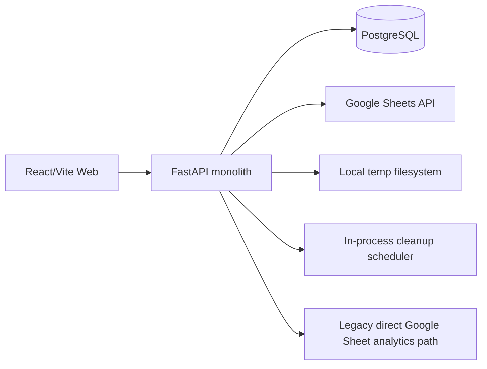

# Architecture and Technical Debt

## Current Architecture

## Main Debt

### God modules

- `analytics_repository.py`: about 1,600 lines.
- `Dashboard.jsx`: about 1,640 lines.
- `Configuration.jsx`: about 1,780 lines.
- `import_service.py`: about 1,300 lines.

These modules mix orchestration, policy, mapping, state, and presentation/query concerns.

### Dual data paths

Dashboard supports both DB analytics and legacy direct Google Sheet logic. This doubles contracts and makes correctness dependent on auth mode.

### Synchronous jobs

Google sync, import spreadsheet append, and classification execute in request lifecycles. They need durable command/job boundaries.

### Role model ambiguity

Global user roles and workspace membership roles are both named `role`, causing authorization mistakes.

### Process-local infrastructure

Cache, temp files, and cleanup scheduler are local to one process/instance.

### Duplicated frontend infrastructure

Every API module independently reads localStorage, builds headers, and handles auth errors. There is no shared Axios instance, request cancellation, retry policy, or query cache.

### Migration governance

Full filenames are used as migration versions, but numeric prefixes are duplicated and no CI rule prevents collisions.

## Target Boundaries

- Identity/session service boundary inside the monolith.
- Central workspace authorization policy.
- Transaction ledger domain.
- Import domain with outbox delivery.
- Google source/sync domain with durable jobs.
- Analytics read model/BFF.
- Budget domain using canonical category IDs.
- Shared frontend API/query layer.

Keep a modular monolith first. Microservices are not justified until queue, ownership, and observability boundaries are proven.

