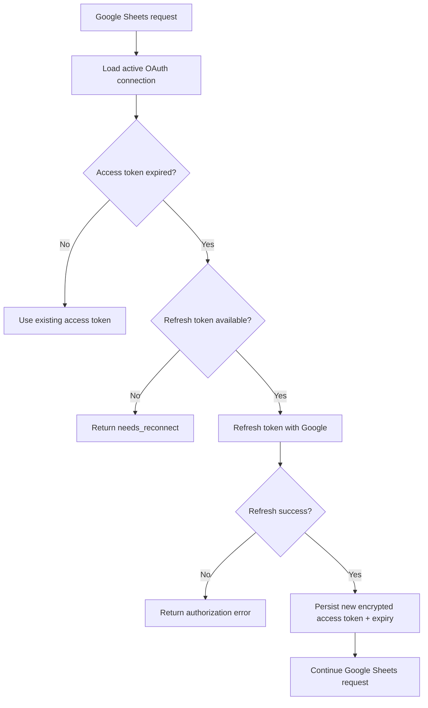

# UAT-GS-003 — Google OAuth Token Refresh

## Status

PASS

## Root cause

Google OAuth connection row stayed `active`, but the stored `access_token` had expired. The backend paths for Google Sheets access decrypted `access_token_encrypted` directly and called the Google Sheets API without refreshing it first.

Verified evidence:

- `has_refresh_token`: true
- `has_access_token`: true
- `token_expiry`: 2026-06-23 16:52 WIB
- audit time: 2026-06-25 10:27 WIB
- scopes include `https://www.googleapis.com/auth/spreadsheets`

## Fix summary

- Added centralized Google token helper.
- If access token is still valid, reuse it.
- If access token is expired and refresh token exists, refresh via Google token endpoint.
- Persist refreshed encrypted access token and new `token_expiry`.
- Return controlled reconnect/authorization errors when refresh is not possible.
- Applied helper before Google Sheets API calls in data source and import delivery paths.

## Files changed

- `backend/app/services/google_token_service.py`
- `backend/app/repositories/google_oauth_repository.py`
- `backend/app/api/data_sources.py`
- `backend/app/api/google_connection.py`
- `backend/app/imports/services/import_service.py`
- `backend/app/imports/services/spreadsheet_sync_service.py`
- `backend/tests/test_google_token_service.py`
- `backend/tests/imports/test_blu_pdf_parser.py`

## Token refresh behavior

## Validation

- Simulated expired access token with valid refresh token: PASS.
- Refresh helper updates encrypted access token and expiry: PASS.
- Expired token without refresh token returns controlled reconnect error: PASS.
- Manual UAT confirmed previous 401 no longer occurs.
- Targeted backend tests: 74 PASS.
- Web lint: PASS.

## Ledger verification

- Final transactions: 25
- Total expense: Rp1.867.169
- Approved registry: 25
- Rejected registry: 11
- Sync jobs: 0

## Notes

This fix does not alter ledger persistence, fingerprinting, delivery routing, or datetime formatting behavior. UAT-GS-002A live verification was resumed after token refresh was validated.
